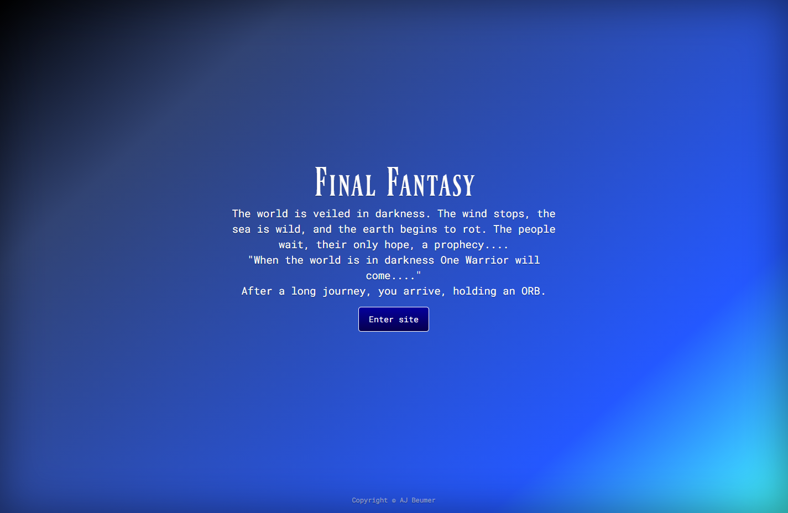
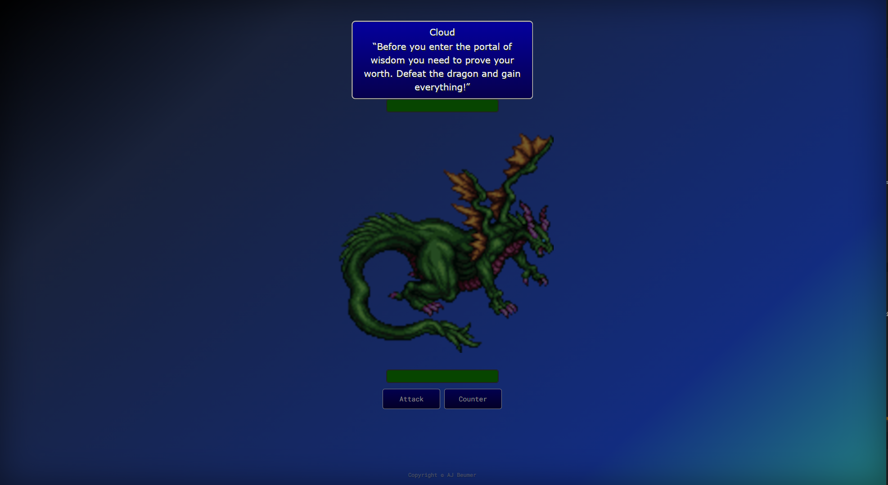
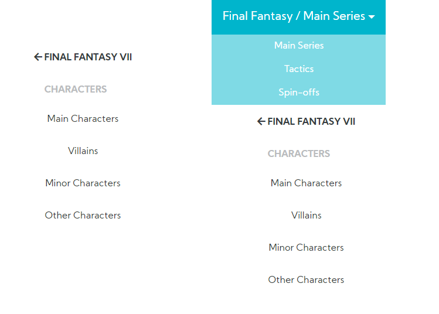
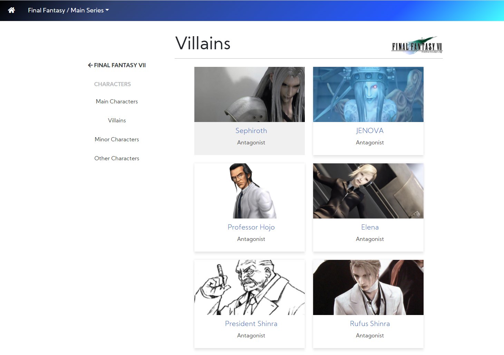

<h1 align="center">
Interactive Frontend Development - Milestone Project 2 - Final Fantasy wiki - Aart-Jan Beumer
</h1>

<h1>

</h1>
 
For Milestone Project 2 I created a wiki like web-application, <a href ="assets/js/resources.js">with a custom build JavaScript navigation</a>, to create a portal for all the info (wip) you can find for the Final Fantasy games.
 
 

[Visit my personal site here](https://ajbeumer.github.io/ms2-ff-repo/)
 
[Visit my GitHub repository here](https://github.com/AJBeumer/ms2-ff-repo)

## Table of Content

1. [**UX**](#ux)
    - [**Project Purpose**](#project-purpose)
    - [**User Experience**](#user-experience)
    - [**User Stories**](#user-stories)
    - [**Design Ideas**](#design-ideas)
    - [**Wireframes**](#wireframes)
    - [**Developer and Business Purpose**](#developer-and-business-purpose)

2. [**Features**](#features)
    - [**Existing Features**](#existing-features)
    - [**Features Left to Implement**](#features-left-to-implement)

3. [**Technologies Used**](#technologies-used)

4. [**Testing**](#testing)

5. [**Deployment**](#deployment)

6. [**Credits**](#credits)
    - [**Content**](#content)
    - [**Media**](#media)
    - [**Help with code**](#help-with-code)
    - [**Acknowledgements**](#acknowledgements)

7. [**Disclaimer**](#disclaimer)

## UX

### Project Purpose

The main purpose of this website is to create a portal to find everything about the Final Fantasy games. From the music of the games to information about cities and characters. 
The site is mainly for Final Fantasy fans of all games.

### User Experience

- Visitors of the site will visit a website that works exactly as they expect. They will know without thinking how to navigate and interact through the site.
- The site is based upon a minimalistic approach to focus on the content without distraction.
- Efficiency was big part of the site, the visitor always knows where they are on the site and how to proceed. When visiting a page its also visible in the menu which page is active. 

### User Stories

As a user I would like to see:

- easy navigation to find content and to know exactly where I am on a website
- different styling to also know where I am on a website
- simple and easy to use controls
- a fun and engaging landing page

### Design Ideas

##### Fonts:

- [Roboto Mono](https://fonts.google.com/specimen/Roboto+Mono?query=roboto+mo) is used on the landing page to give it a more old-school look.
- [Ferrum font](https://www.fontspace.com/ferrum-font-f6281) is used for the Final Fantasy header on the landing page to resemble a traditional logo.
- [Kumbh Sans](https://fonts.google.com/specimen/Kumbh+Sans) is used as the primary font on the info pages for a clean look and easy to read.

##### Colors:

The site makes use of different colors per theme. All the colors and combinations used on the site are colors used in [games](https://imgur.com/gallery/sKP6G): 
- linear-gradient(138deg, rgba(0,0,0,1) 0%, rgba(49,67,115,1) 22%, rgba(36,88,255,1) 78%, rgba(68,255,255,1) 100%) is a gradient black to light blue gradient that is used on the landing page and as navigation and footer for the "main-series" section of the site.
- linear-gradient(138deg, rgba(50,0,0,1) 0%, rgba(120,0,0,1) 22%, rgba(175,50,0,1) 78%, rgba(255,200,0,1) 100%)  is a dark red to yellow gradient that is used for the navigation and footer for the "tactics" section of the site.
- linear-gradient(138deg, rgba(0,0,0,1) 0%, rgba(81,0,255,1) 22%, rgba(255,111,111,1) 78%, rgba(173,197,0,1) 100%) is a gradient from blue to pink to yellow which is used in the "spin-off" section of the site as it combines the colors from the gradients mentioned above.

To generate the gradients for the application I used [https://cssgradient.io/](https://cssgradient.io/).

On the landing page:
- rgb(4, 0, 157) or (#04009d) is used to resemble the text menu's and boxes in the final fantasy 7 game. 

##### Styling:
For styling a minimalistic approach was chosen to give a clean look and put the focus more on the content.
 
 
 Special styles include:
- <b>games franchise</b> - for eacht of the main topics (Main Series | Tactics | Spin-Offs) I chose a different color schema which was based upon color schema's from the Final Fantasy games.
- <b>the Dragon</b> - the Dragon is a sprite that is loaded by pure CSS and is 1 image.
- <b>modal</b> - the modal on the `index.html` page is a representation of a Final Fantasy 7 text block.
- <b>buttons and battle text</b> - on the `index.html` page are a representation of a Final Fantasy 7 text block.
- <b>hp bars</b> - the hp bar uses multiple colors to show the user how much damage was inflicted.

### Wireframes
Balsamiq is used to create wireframes of the site for desktop, tablet and mobile view.

- [Landing page](assets/images/readme/landing_page.png) -> an outline of how the landing page should look like.
- [Main pages and toggle](assets/images/readme/main-pages-toggle.png) -> an outline on how the main page should look like and how to browse between the 3 main pages.
- [Sub-pages and menu](assets/images/readme/sub-pages-and-menu.png) -> an outline on how the submenu will look like with integration of menu.

### Developer and Business Purpose
1. Demonstration of learned skills (HTML5/CSS/Bootstrap/JavaScript) throughout the first two modules
2. Good website to use for portfolio
3. Enjoy coding by building this
4. Finding a good solution for big menu's without losing track where a user is and use lots of screen space.
5. Must show clear & professional examples of JavaScript and jQuery

## Features

### Existing Features

1 <b>Boss fight</b>
    
   * When you arrive on the landing page the user can press the "enter site" button which will initiate a boss fight to ensure the user "worthy" enough to enter the site.
   * A modal in a ff7 theme will pop up to give the user explanation.
   * User can start the fight by either clicking attack or counter. 
   * A hp-bar shows the user how much damage both the boss as the user took. 
   * When the hp of user reaches 0, user will get message to press f5 to start over again.
   * If the boss' hp reaches 0, user will be shown a button to enter the site.
    
   

   
   

    
   
2 <b>Navigation menu</b> 
 
   * A javascript based menu that allows a user to navigate easily through the site and keep in track where they currently are.
   * Menu makes use of different "depths" that overwrites each other to hide previous en new menu's.
   * When the user navigates through the menu the user will always see 3 recurring elements which is the a back functionality on top to previous menu, a header 
   that gives the user the name of current menu and the menu itself.
   * When a user is using a mobile device the dropdown for the different main-topics and the navigation are included in the same menu to ensure that the user can navigate easily.
  
    
      

      
      

       
   
   
3 <b>Content section hover</b> 
   * allows the user to see which item they are selecting.
   
    
         

         
         

          
         
4 <b>Changing color schema based on topic</b> 
   * allows user to visually see in which topic they currently are.
   * Color schema is changed upon clicking on a different topic and bot the top-navigation as the footer will change
   

### Features Left to Implement

- I would like to connect to multiple API's for data, have the data stored as XML for metadata purposes.
- Search functionality based on metadata.
- Have a better fight system on landing page to add healing, difficulty setting to be more challenging.
- Implement a link checker to check if a resource redirects to a dead link.
- Make the application work for Internet Explorer as it does not support template literals. As IE only has a market share of around 2,5% it was not my main focus to implement it for release 1.

## Technologies Used
This project made use of the following technologies:

- HTML | CSS | JavaScript - HTML5 and CSS3 was used for the styling of the website and Javascript was used for the navigation menu and boss fight.

- [WebStorm](https://www.jetbrains.com/webstorm/) - the IDE to develop the website.

- [Git Server](https://git-scm.com/) - to backup the code and version control locally as network card died.

- [GitHub](https://github.com/) - to backup the final code.

- [Google Fonts](https://fonts.google.com/) - to provide the fonts for the website.

- [Font Awesome](https://fontawesome.com/) - to provide icons.

- [Bootstrap](https://getbootstrap.com/) - to provide an easy grid-system and easy to use components.

- [AutoPrefixer](https://autoprefixer.github.io/) - AutoPrefixer is used to ensure all css prefixes are running with the most up to date versions.

- <b>JQuery</b> - JQuery has been used to simplify DOM manipulation.

## Testing

I tested the validity of my code by using [W3C Markup Validation Service](https://validator.w3.org/) to ensure my HTML was valid. Also the build in validator in 
my IDE [WebStorm](https://www.jetbrains.com/webstorm/) helped me validate and format my code. To test my JavaScript I used [jsfiddle](https://jsfiddle.net/) to ensure I had no major mistakes in the code. 

### Testing devices
I tested the site on two different machines:
1) Windows OS with a 3440x1400 screen. Browsers used for testing: Chrome (version 81.0.4044.138), Firefox (version 76.0.1), Microsoft Edge (version 44.18362.449.0), Internet Explorer (version 11.836.18362.0)
2) MacBook Pro with a 2880x1800 screen. Browsers used for testing: Chrome (version 81.0.4044.138), Safari (version 13.1)

In the development tools of Chrome I tested the site on all the different mobile devices and tablets to ensure the site, not only looked, but also worked the same as expected.
 The styling (CSS) of the site was tested throughout development to make sure styling would look exactly the same on all the browsers and devices. 
 The Javascript code was tested throughout development by using the console in the browser and make use of `console.log()` to see if the outcome was as expected.

All tests are similar in all the different browsers except for Internet Explorer as I use template literals and unfortunately that is not supported by IE11

##### Testing the landing page
The steps I took to test the landing page are:
1) Hover over the 'Enter site' button to see if hover effect is in place.
2) Click on the 'Enter site' button to check if the modal is appearing and the boss fight in the background.
3) Click anywhere on the screen to check if the modal will disappear. 

##### Testing the boss fight
The steps I took to test the boss fight are:
1) Hover over the 'Attack' and 'Counter' buttons to see if hover effect is in place.
2) Click on 'Attack' button to check if battle text is displayed.
3) Refreshed the page and click on 'Counter' button to check if battle text is displayed.
4) By pressing either button check if correct battletext is displayed.
5) By having and getting damage check if the color of the hp-bars change to the correct colors.
6) Tested when user hits 0 hp the correct text is shown that player lost and needs to refresh the page to continue.
7) Tested when boss hits 0 hp that boss fight is gone and you get the ff7 themed "Thank you" message and a new 'Enter site' button appears.
8) Hover over the 'Enter site' button to see if hover effect is in place.
9) Click on the 'Enter site' button to check if it redirects you to the main-content page.

##### Testing top dropdown navigation menu

The steps I took to test the top dropdown navigation menu are:
1) Hover over the Final Fantasy / dropdown on all main pages (Main Series | Tactics | Spin-Offs) to see if the underline was shown.
2) Hover over all the navigation items (Main Series | Tactics | Spin-Offs) on all main pages (Main Series | Tactics | Spin-Offs) to check if there was a light grey background change.
3) Clicked all the navigation items (Main Series | Tactics | Spin-Offs) on all the pages to test if the links worked and were referring to the correct main page.
3) Clicked on the top left home logo on all the pages to see if the link resets the page.
4) Resized the browser to make sure the the dropdown menu was combined with the resource navigation menu.

##### Testing resource navigation menu

The steps I took to test the resource navigation menu are:
1) Hover over all the navigation items from top menu to bottom menu (e.g. Final Fantasy VII > Characters > Villains) on all main pages (Main Series | Tactics | Spin-Offs) to check if there was a light grey background change.
2) Clicked all the navigation items (from top menu to bottom menu (e.g. Final Fantasy VII > Characters > Villains) on all main pages (Main Series | Tactics | Spin-Offs) to test if the correct content was shown.
3) Resized the browser to make sure the the resource navigation menu was combined with the top dropdown navigation menu.

##### Testing `resource-main` page

When the user clicks on the 'General' navigation item, general info about the game is displayed. The steps I took to test it are:
1) Go to the general navigation item for each game in every main pages (Main Series | Tactics | Spin-Offs).
2) Click on the 'General' item to check if the correct text is displayed.

##### Testing `resource-cards`

The steps I took to test the resource cards are:
1) Clicked on all the navigation items from top menu to bottom menu (e.g. Final Fantasy VII > Characters > Villains) on all main pages 
(Main Series | Tactics | Spin-Offs) to check if the correct resource cards were shown.
2) Hover over all the resource cards to check if the hover effect was shown.
3) Clicked on all the resource cards to check if it redirected me to the correct resource.
4) Resized the browser to test if resource cards went from multiple in a row to 1 in a row on mobile devices.
5) Tested to see if the resource cards had image in left of the text until `1269px` width and text on the right side of the image.

## Deployment

I build the website using [WebStorm](https://www.jetbrains.com/webstorm/) which has GIT as a build in function to commit and push the code to my GitHub repository.  

To commit the code the following commands were used:
1) `git add .` to move all changes to the staging environment or `git add (filename)` to move a specific file to the staging environment.
2) `git commit -m "message here""` to save the changes with the message what the changes include.
3) `git push` moves the changes from the local repository to the github repository.

To view the deployed version of my website I needed to take the following steps:
1. Log in to GitHub.
2. Select AJBeumer/ms2-ff-data from the list of repositories.
3. Select Settings from the navbar near the top of the page.
4. Scroll down to where it says Github Pages, there is a subtitle labelled Source, click that and change the source to be master branch.
5. The page is automatically refreshed and ready for deployment, it can take up to 5-10 minutes for it to be viewable.

## Credits

### Content

All the information about each FF game used in the application is from wikipedia:
- [Final Fantasy 7 wikipedia](https://en.wikipedia.org/wiki/Final_Fantasy_VII)
- [Final Fantay 14 wikipedia](https://en.wikipedia.org/wiki/Final_Fantasy_XIV)
- [Final Fantay 15 wikipedia](https://en.wikipedia.org/wiki/Final_Fantasy_XV)

### Media

Images of the characters are used from [Final Fantasy Union](https://www.finalfantasyunion.com/characters/final-fantasy-vii/). 
All the other images are copyrighted by [Square Enix](https://www.square-enix.com/) the developer of the Final Fantasy games.

### Help with code

- Ideas on how to create a [simple turned based fight](https://codepen.io/Limey_88/pen/gbypXg)
- CodeInstitute in teaching me HTML|CSS|Bootstrap|Javascript|JQuery

### Acknowledgements

I want to thank:

- my mentor Spencer Barriball (spence_mentor) for keeping me on track, giving tips on how to solve difficulties I was running into and where to focus.
- JoWings_alumna for helping me with some struggles I had with the boss fight.

### Disclaimer

The information contained in this website is for general information and educational purposes only. 

